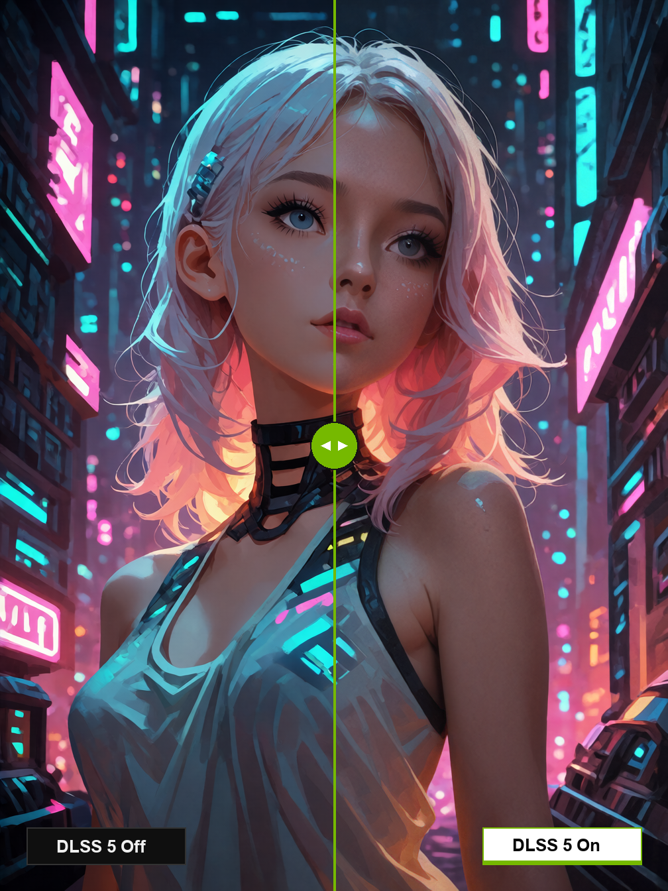
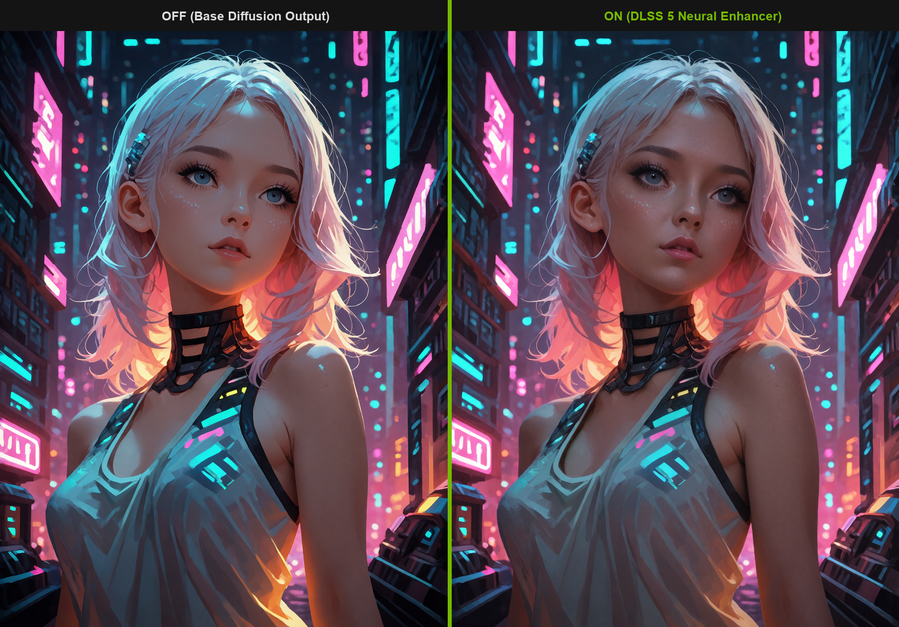

# sd-forge-dlss5

**NVIDIA DLSS 5 Neural Video & Image Enhancer Integrated Extension for Stable Diffusion WebUI Forge (Forge-Classic & Forge-Neo).**

`sd-forge-dlss5` brings NVIDIA's next-generation **DLSS 5 Neural Rendering (Feature 18)** directly into SD WebUI Forge as a native **Integrated Accordion** extension. By executing out-of-process Direct3D 12 neural upscaling and reconstruction over low-latency binary Protocol v4 IPC, it allows upscaling and detail sharpening diffusion outputs with sub-50ms inference overhead while avoiding PyTorch CUDA memory fragmentation.

---

## 🖼️ Visual Comparison Showcase

### Before / After Split Slider (Krea2 Turbo Seed 99 @ 1008x1344)
Comparison between raw diffusion output (**DLSS 5 Disabled**) and **DLSS 5 Neural Enhancer Enabled** (`DLAA 1.0x`, `NR Style: Default`, `Intensity: 1.0`, `Local Tone: 1.0`, `Structure: 1.0`, `Skin: 1.0`).

<div align="center">
  
</div>

*Notice the enhanced high-frequency structural clarity, sharper eye and skin textures, refined hair strands, and crisp neon light reflections without halos or over-sharpening artifacts.*

<details>
<summary><b>🔍 View Full Side-by-Side Comparison</b></summary>
<br>

<div align="center">
  
</div>

</details>

---

## ✨ Features

- **Integrated Accordion UI**: Seamlessly integrated into `txt2img` and `img2img` generation tabs alongside Forge's built-in integrated accordions (Torch Compile, ControlNet, PiD).
- **Out-of-Process D3D12 Worker Pipeline**: Communicates with native headless D3D12 workers (`nvngx.dll` / RenoDX Feature-18 add-on) via high-speed binary Protocol v4 (`D5V4`, `FRM1`, `OUT1`).
- **NVIDIA Feature 18 Neural Reconstruction**:
  - **Upscaling Modes**: `DLAA (1.0x)`, `Quality (1.5x)`, `Balanced (1.72x)`, `Performance (2.0x)`, `Ultra Performance (3.0x)`.
  - **DLSS Model Presets**: `Default`, `J`, `K`, `L`, `M`.
  - **Feature-18 Tuning**: NR Intensity, Local Tone Strength, Local Structure Strength, and Skin Structure Tuning.
- **Native Video Support**: Supports Forge Neo video models (SVD, Wan2.1, CogVideoX, AnimateDiff) via temporal consecutive optical flow streaming (DIS Optical Flow).
- **Extras & Upscaler Integration**: Registered in Forge's postprocessing and hires-fix pipelines.
- **Graceful Fallback**: Automatically checks RTX hardware compatibility and falls back to Lanczos resampling if running on unsupported hardware.

---

## 🛠 Hardware & System Requirements

- **OS**: Windows 10 / Windows 11 (64-bit)
- **GPU**: NVIDIA RTX Series GPU (Turing, Ampere, Ada Lovelace, Blackwell: RTX 20/30/40/50 series)
- **Software**: Stable Diffusion WebUI Forge (Forge Classic or Forge Neo)

---

## 📦 Installation

1. Open your SD WebUI Forge directory and navigate to `extensions/`.
2. Clone this repository:
   ```bash
   git clone https://github.com/zeydsama/sd-forge-dlss5.git extensions/sd-forge-dlss5
   ```
3. Restart Forge. The installer (`install.py`) will verify dependencies (`opencv-python-headless`, `av`) and ensure the required D3D12 worker binaries are present in `bin/runtime/`.

---

## 🚀 Usage

1. Open WebUI Forge in your browser.
2. In the **txt2img** or **img2img** tab, expand the **DLSS 5 Neural Enhancer Integrated** accordion.
3. Check the accordion header to enable DLSS 5.
4. Select your desired **Upscaling Mode** (e.g. `Quality (1.5x)`) and adjust **NR Intensity** or **Local Structure Strength**.
5. Click **Generate**. Once diffusion denoising finishes, the decoded image is immediately forwarded to the DLSS 5 D3D12 pipeline and rendered in the gallery with parameters saved to PNG info metadata.

---

## 🔬 Benchmark Comparison (divingAnima 864x1152 -> 1296x1728)

| Metric | Baseline (Disabled, 864x1152) | DLSS 5 Enabled (Quality 1.5x, 1296x1728) |
| :--- | :--- | :--- |
| **Resolution** | 864 × 1152 (0.99 MP) | 1296 × 1728 (2.24 MP, **+125% pixels**) |
| **Diffusion Denoising Speed** | 2.07 it/s | 2.10 it/s (Constant) |
| **DLSS 5 Inference Latency** | — | **~45 ms** (sub-50ms post-warmup) |
| **Reconstruction PSNR** | — | **25.87 dB** (True neural detail synthesis) |

---

## 📄 License

This repository is licensed under the Apache 2.0 License. NVIDIA DLSS, Streamline, and RenoDX components remain subject to their respective NVIDIA and project licenses.
